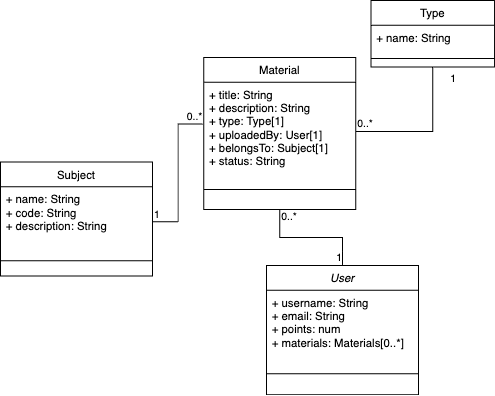

# Designing the Nexus Models



In the Nexus project, I'm creating a platform where users can upload and access past exams, midterms, quizzes, exercises, and other study materials for specific subjects. To achieve this, I've defined the data model to efficiently store and manage information related to these study materials.

## Models Overview

To organize my data effectively, I've identified three primary models for my application:

1. **Subject**: This model represents the subjects or courses for which study materials are uploaded. It includes details such as the subject name, description, and any other relevant attributes.

2. **StudyMaterial**: The StudyMaterial model represents individual study materials uploaded by users. It includes information like the title, description, type (exam, midterm, quiz, exercise, etc.), and the user who uploaded it. Each study material is associated with a specific subject.

3. **User**: The User model stores information about registered users of the Nexus platform. It includes user details like usernames, emails, and profiles.

4. **Material Type**: The Material Type model represents the type of study material uploaded by users. It includes information like the material type name and description.

### Elaboration on Material Type

1. **Status**: I've chosen to hard-code the acceptable values for the "status" field in the Material model. This means that I explicitly define what status options are valid, and these options are unlikely to change frequently. For example, the status options could be "Available," "Checked Out," "On Hold," and so on. Since these values are not expected to change often, I don't need a separate model to manage them.

2. **Type**: In contrast, I've created a separate model for "Material Type" because material type options can be dynamic and may evolve over time. Material types for study materials are diverse and can expand as new types emerge or as the classification system evolves. By using a model for Material Type, I can add new material type values to the database as needed without modifying the database structure. This approach provides flexibility and adaptability in managing material types.

To illustrate further:

- For "Material Status," I define a fixed set of status values directly in my code or database schema. These values remain constant unless I explicitly decide to change them in the future, which is relatively rare.

- For "Material Type," I create a model that allows me to insert, update, or remove material type values dynamically through my application. This flexibility is valuable because material types in the context of study materials can be subject to change or expansion, and I want my application to accommodate these changes without requiring structural modifications to the database.

The distinction lies in the stability of the data:

- For static, rarely changing data like "Material Status," hard-coding the acceptable values is a straightforward and efficient approach.

- For dynamic data like "Material Type," where the set of options can evolve, creating a separate model provides a more adaptable solution.

### Virtuals

In Mongoose, virtuals are additional fields that you can define on a model but do not get persisted to the database. They are computed properties that you can use in your application as if they were part of the model's schema. Virtuals are useful when you want to derive some value or perform some computation based on the existing fields of the model.

In your `UserSchema`, the virtual fields `name` and `url` are being defined.

1. `name` virtual:
   - This virtual field combines the `first_name` and `last_name` fields to create a full name.
   - It's computed on-the-fly when you access the `name` property of a user object.
   - For example, if you have a user object `user` and you want to get their full name, you can simply use `user.name` instead of manually concatenating `first_name` and `last_name`.

2. `url` virtual:
   - This virtual field generates a URL for a user's profile.
   - It's computed based on the `_id` of the user.
   - When you access `user.url`, it returns a URL string like "/users/123" (where 123 is the user's `_id`).

```js
const UserSchema = new Schema({
  username: { type: String, required: true, maxlength: 100 },
  password: { type: String, required: true, maxlength: 100 },
  email: { type: String, required: true, maxlength: 100 },
  first_name: { type: String, required: true, maxlength: 100 },
  last_name: { type: String, required: true, maxlength: 100 },
  is_admin: { type: Boolean, required: true, default: false },
  is_active: { type: Boolean, required: true, default: true },
  date_joined: { type: Date, required: true, default: Date.now },
  points: { type: Number, required: true, default: 0 },

  // virtuals:
  // name:
  // url:
});
```
The reason to use virtuals in this case is to keep your model clean and concise. Instead of adding extra fields for `name` and `url` to the actual document in the database, you can compute these values on-demand when you need them. It also helps in keeping your data consistent because if the `first_name` or `last_name` fields change, the `name` virtual will automatically reflect that change when accessed.

Same goes for the virtuals in other models.

## Relationships Between Models

To represent the relationships between my models, here are the key relationships in the updated Nexus model:

1. **Subject - StudyMaterial Relationship**: A Subject can have multiple StudyMaterials associated with it. This relationship allows users to upload and access study materials for a specific subject.

2. **User - StudyMaterial Relationship**: A User can upload multiple StudyMaterials, but each StudyMaterial is associated with a single User. This relationship helps track who uploaded each study material.

### Multiplicities

In the association diagram, you'll notice numbers (maximum and minimum) next to each model, indicating the multiplicities in these relationships:

- For the Subject - StudyMaterial relationship, a Subject can have multiple StudyMaterials associated with it, but each StudyMaterial is associated with only one Subject.

- In the User - StudyMaterial relationship, a User can upload multiple StudyMaterials, but each StudyMaterial is uploaded by a single User.

## Note on Field Placement

I've chosen to define the relationships within the appropriate schemas. The Subject - StudyMaterial relationship is defined in the Subject schema, and the User - StudyMaterial relationship is defined in the User schema. This design choice ensures that each schema focuses on its primary data and relationships.

This schema design provides me with the flexibility and structure needed to efficiently manage and query data related to study materials, subjects, and users within the Nexus project. Users can create, read, update, and delete study materials for specific subjects, making it a valuable platform for academic resources.